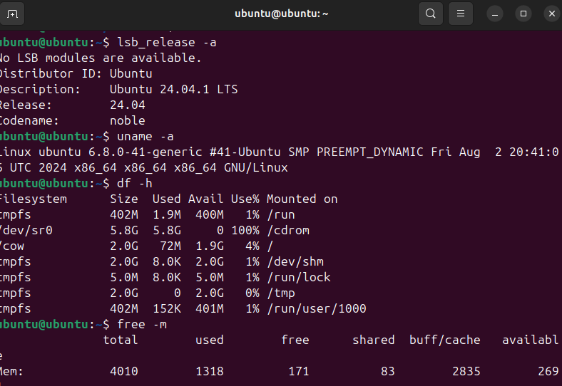

# Laporan beberapa terminal code ubuntu

NAMA : M WALID FARHAN

KELAS :TK4A

NIM : 09030282327039

Selamat datang di github saya, pada blog ini saya hanya akan menuliskan dan menjelaskan laporan sistem operasi apa saja yang telah saya pelajarin di kampus. Saya telah mempelajarin bagaimana cara menggunakan code code yang ada di terminal ubuntu. saya akan memberikan berbagai code terminal ubuntu dan apa saja fungsi dari code tersebut.

 

Berikut BEBERAPA CODE TERMINAL yang biasa saya gunakan, sesuai foto diatas

1. mkdir berfungsi untuk Membuat direktori baru

2. nano namafile.txt berfungsi untuk membuat file menjadi txt

3. cat namafile.txt berfungsi untuk membuka file txt yang dipanggil ( namafile.txt )

4. rm namafile.txt berfungsi untuk menghapus file yang dipanggil.

5. ls berfungsi untuk melihat isi direktori

6. cd berfungsi untuk membuka direktori

7. cp berfungsi untuk menyalin file

8. mv berfungsi untuk mengubah nama file

# beberapa code terminal lainnya

9.  lsb_release -a berfungsi untuk melihat versi ubuntu yang digunakan

10.  uname -a berfungsi untuk menampilkan sistem operasi

11.  df -h berfungsi Menampilkan ruang disk yang digunakan

12.  free -m berfungsi Menampilkan penggunaan RAM dalam MB.

13.  lscpu berfungsi Menampilkan detail prosesor.

14.  sudo adduser nama_user berfungsi untuk membuat pengguna baru

15.  sudo deluser nama_user berfungsi untuk menghapus pengguna dari sistem

16.  who berfungisi Menampilkan pengguna yang sedang login
    
17.  whoami berfungsi Menampilkan nama pengguna yang sedang login.

18.  passwd berfungsi mengubah password pengguna saat ini.

19.  ps aux berfungsi Menampilkan semua proses yang berjalan

20.  top Fungsi: Menampilkan proses dalam tampilan real-time.

21.  kill namafile Fungsi: Menghentikan proses dengan PID namafile.

22. pkill namafile Fungsi: Menghentikan semua proses dengan nama tertentu.

23. nohup python script.py & berfungsi  Menjalankan perintah tanpa terganggu saat logout.

24. sudo apt update berfungsi memperbarui paket yang tersedia

25. sudo apt upgrade -y berfungsi memperbaru semua paket baru

26. sudo apt remove nama_paket berfungsi Menghapus paket beserta konfigurasinya.

27. ip a berfungsi menampilkan alamat ip pengguna

28. ip route berfungsi nemapilkan lalu lintas internet yang digunakan

29. ping google.com berfungsi mengecek koneksi internet

30. netstat -tulnp Fungsi: Menampilkan koneksi jaringan aktif.

31. 
 

